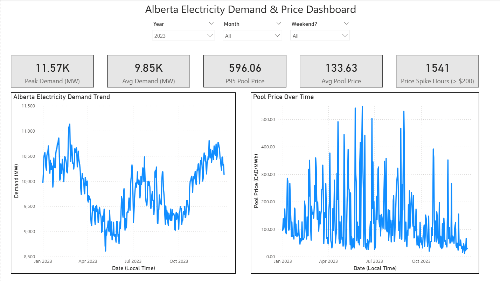
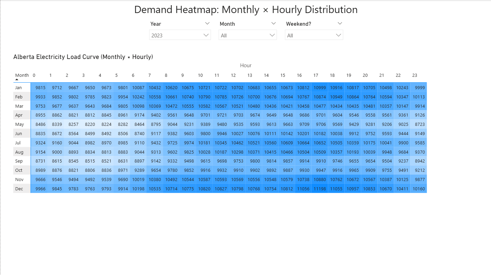
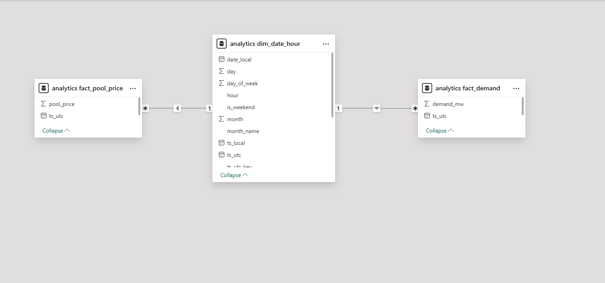

# Alberta Electricity Demand & Pool Price Analytics

### ETL + Dimensional Modeling + Power BI

------------------------------------------------------------------------

## Overview

This project explores Alberta’s hourly electricity demand and pool price
behavior (2020–2025) through an end-to-end data pipeline and analytical
dashboard.

It was built to:

- Practice ETL pipeline development
- Apply dimensional modeling concepts
- Learn and implement Power BI for analytical storytelling
- Explore market volatility through structured KPIs

The result is a balanced data engineering + BI project built on publicly
available Alberta market data.

------------------------------------------------------------------------

## Architecture

Public CSV Data  
↓  
Python ETL (Pandas)  
↓  
PostgreSQL (Docker)  
↓  
Star Schema (dim + fact)  
↓  
Power BI Dashboard

### Components

- **Docker Compose** — PostgreSQL + Adminer  
- **Python ETL** — Loads and transforms raw hourly CSV data  
- **PostgreSQL** — Stores raw and analytics schemas  
- **Power BI Desktop** — Interactive reporting layer

------------------------------------------------------------------------
## Dataset Scope

This implementation loads:

- 2020 – July 2025 AESO hourly market data  
- ~48,935 hourly records  
- UTC-normalized timestamps  
- Demand (MW) and Pool Price (CAD/MWh)

The dataset includes Alberta Internal Load (AIL) and market pricing data.

## Data Source

The dataset used in this project is publicly available from the Alberta Electric System Operator (AESO):

Hourly Generation Metered Volumes and Pool Price and AIL Data (2001–July 2025)

Source:  
https://www.aeso.ca/market/market-and-system-reporting/data-requests/hourly-generation-metered-volumes-and-pool-price-and-ail-data-2001-to-july-2025/

For this implementation, the file used was: `Hourly_Metered_Volumes_and_Pool_Price_and_AIL_2020-Jul2025.csv`

------------------------------------------------------------------------
## Data Model

A star schema was implemented to support clean analytical queries.

### Dimension

`analytics.dim_date_hour`

- ts_utc_key (surrogate key derived from UTC timestamp)
- date_local
- year, month, day
- hour
- is_weekend

### Timestamp Fields Clarification

The model includes both `ts_utc` and `ts_utc_key`, which serve different purposes.

- `ts_utc`  
  - The actual UTC timestamp (derived from `Date_Begin_GMT`)  
  - Used for time-based calculations and reference  
  - Preserves the original temporal accuracy  

- `ts_utc_key`  
  - A surrogate key derived from the UTC timestamp in the format `YYYYMMDDHH`  
  - Used strictly for relational joins between dimension and fact tables  
  - Ensures uniqueness across Daylight Saving Time boundaries  

`ts_utc_key` exists to guarantee a stable one-to-many relationship in Power BI.  
It should not be confused with the actual timestamp field (`ts_utc`), which retains full datetime precision.

### Facts

`analytics.fact_demand`
- ts_utc_key
- demand_mw

`analytics.fact_pool_price`
- ts_utc_key
- pool_price

Relationships:

dim_date_hour (1 : M) fact_demand  
dim_date_hour (1 : M) fact_pool_price

------------------------------------------------------------------------

## Daylight Saving Time (DST) Handling

Alberta observes Daylight Saving Time, which introduces:

- A missing hour in spring
- A duplicated local hour in fall (e.g., 1:00 AM occurs twice)

Using `date_local` directly as a key would create:

- Duplicate dimension values
- Broken one-to-many relationships
- Incorrect aggregations in Power BI

### Solution

The model uses a UTC-derived surrogate key:

`ts_utc_key = YYYYMMDDHH (from Date_Begin_GMT)`

This guarantees:

- Unique hourly identifiers
- Stable star schema joins
- Correct aggregation across DST boundaries

Local time is preserved for reporting, while UTC ensures relational
integrity.

------------------------------------------------------------------------

## Key Metrics

The dashboard computes:

- Peak Demand (MW)
- Average Demand (MW)
- Average Pool Price (CAD/MWh)
- 95th Percentile Pool Price
- High-Price Hours (\> \$200)

These measures highlight structural volatility changes across years.

The 2023 dataset demonstrates a significant increase in high-price frequency relative to 2020, while demand growth remained comparatively stable.

------------------------------------------------------------------------

## Dashboard Structure

### Page 1 — Market Overview

- Year / Month / Weekend slicers
- KPI summary cards
- Demand trend (time series)
- Pool price trend (time series)

### Page 2 — Load Profile Heatmap

- Month × Hour matrix
- Conditional formatting heatmap
- Visualization of daily and seasonal demand patterns

------------------------------------------------------------------------

## Power BI Requirements

- **Power BI Desktop (latest version recommended)**
- Tested on recent 2024+ versions of Power BI Desktop
- Requires PostgreSQL connector (included in modern versions)

### Download

Power BI Desktop can be downloaded from the Microsoft Store:

Search for:  
**“Power BI Desktop”**

Or download directly from Microsoft’s official site:  
https://www.microsoft.com/power-bi/desktop

The Microsoft Store version is recommended as it updates automatically.

------------------------------------------------------------------------

## Setup Instructions

### Prerequisites

- Docker Desktop
- Python 3.10+ (recommended)
- Power BI Desktop (Microsoft Store version recommended)

### 1. Start PostgreSQL + Adminer (Docker)
> **Note:** If ports 5432 (PostgreSQL) or 8080 (Adminer) are already in use, update the port mappings in `docker-compose.yml` before running `docker-compose up -d`.

``` bash
docker-compose up -d
docker ps
```

Optional checks:
- Adminer: http://localhost:8080
- Postgres: localhost:5432

### 2. Create Schemas and Base Tables
This creates the `raw` and `analytics` schemas and base tables.
```bash
docker exec -i etl_bi_db psql -U etl_bi_user -d etl_bi < sql/01_create_schemas_tables.sql
```

### 3. Load Raw Data

Place CSV inside:

`data_raw/`

Run loader:

``` bash
python etl/load_raw_demand_price.py
```

### 4. Create Analytics Star Schema Tables

```bash
docker exec -i etl_bi_db psql -U etl_bi_user -d etl_bi < sql/02_create_analytics_tables.sql
```

### 5. Transform Raw to Analytics Schema

``` bash
docker exec -i etl_bi_db psql -U etl_bi_user -d etl_bi < sql/03_transform_demand_price.sql
```

### 6. Add DST-safe Surrogate Key + Indexes
Power BI relationships require a unique key on the dimension side.
DST causes duplicate local timestamps (e.g., 1:00 AM appears twice on fall-back),
so this project uses a UTC-derived surrogate key (`ts_utc_key`) for joins.

```bash
docker exec -i etl_bi_db psql -U etl_bi_user -d etl_bi < sql/04_add_utc_key.sql
docker exec -i etl_bi_db psql -U etl_bi_user -d etl_bi < sql/05_add_utc_key_constraints.sql
```

### 7. Open Power BI

Open:

`reports/alberta-electricity-dashboard.pbix`

Ensure the connection points to the local PostgreSQL container.

If prompted:
- Choose PostgreSQL connector
- Point to `localhost:5432`
- Database: etl_bi
- Use the username/password from your `.env` file (or the values in `docker-compose.yml` if you hardcode credentials).

------------------------------------------------------------------------
## Screenshots

### Market Overview


### Hourly Demand Heatmap


### Star Schema Model


------------------------------------------------------------------------

## Technologies Used

- Python
- Pandas
- PostgreSQL 16
- Docker
- Power BI Desktop
- DAX

------------------------------------------------------------------------

## Skills Demonstrated

- ETL pipeline design
- Dockerized database environment
- Dimensional modeling (star schema)
- Time-series data handling
- DST-safe key design
- KPI development in DAX
- Interactive dashboard layout

------------------------------------------------------------------------

## Future Improvements

This project currently loads the 2020–July 2025 dataset. The pipeline can be extended to support:

- 2001–2009 historical data
- 2010 dataset
- 2011–2019 dataset

Enhancements could include:

- Parameterizing the ETL script to dynamically ingest different AESO CSV files
- Automating historical backfill across multiple datasets
- Adding fuel-type level breakdown once generation asset classification is incorporated
- Introducing incremental load logic for near real-time updates

The current schema design supports expansion without structural changes.
------------------------------------------------------------------------

## 👤 Author

George Louie Conde  
Software Developer  
Calgary, AB  
[LinkedIn](https://linkedin.com/in/glconde)  
[GitHub](https://github.com/glconde)

